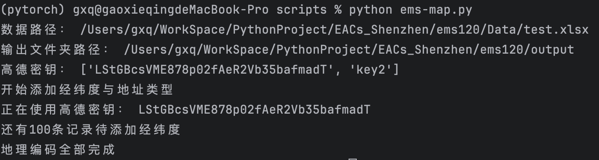

## 如何使用Emergency_QC-master

### 1.环境搭建:
>1）电脑需安装python3.11，下载Emergency_QC-master到本地。

>2）安装requirements.txt中的工具包，可以使用`pip install -r requirements.txt`。

建议：使用conda虚拟环境进行安装，否则工具包版本不匹配容易产生冲突。

注意：1)Emergency_QC-master不包含疾病分类训练的权重文件，可自己训练或留言获取。\
     2)关于pytorch的安装，需要根据电脑型号选择是否安装cuda。\     
     3)原始数据可能存在列名重复的情况，需要修改重复列名。
    

### 2.使用方法（注意先备份原始数据，若无备份可在输出文件夹中找到）
>1）打开终端或cmd，从电脑命令行进入到Emergency_QC-master所在路径，输入 `python main.py`运行程序。

>2）终端会显示输入文件路径，与输出文件夹路径:

>3）本方法需要使用百度地图地理编码API，需要在[百度地图开放平台](https://lbsyun.baidu.com)申请密钥
    

注意：百度地图API一个密钥地理编码上限为5000个/天，数据量过大时需要多个密钥。可以从第一步重复操作，每次输入不同密钥，完成对所有数据的地理编码。

